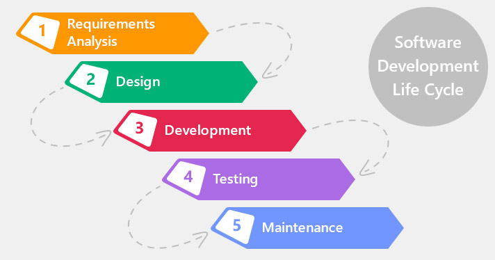

# 4. Metodologías de desarrollo

## Índice

[1. Ciclo de vida del software](#1-ciclo-de-vida-del-software)  
[2. Manifiesto ágil](#2-manifiesto-ágil)

## 1. Ciclo de vida del software

## 2. Manifiesto ágil

.

## Referencias

[Desarrollo en cascada](https://es.wikipedia.org/wiki/Desarrollo_en_cascada)