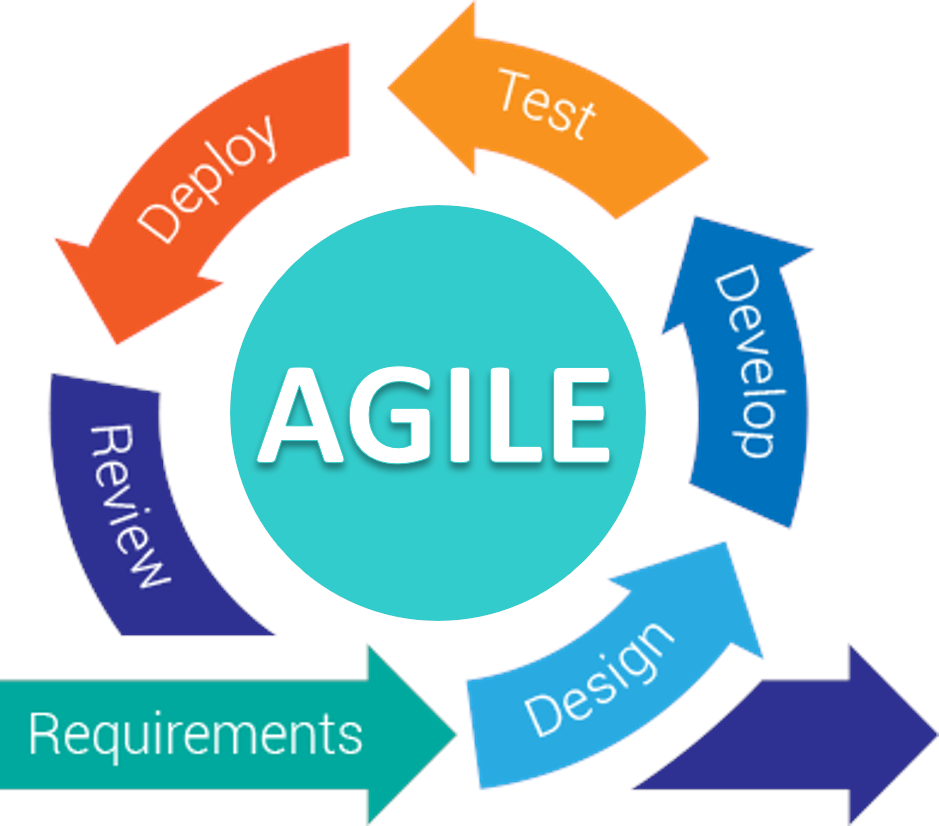
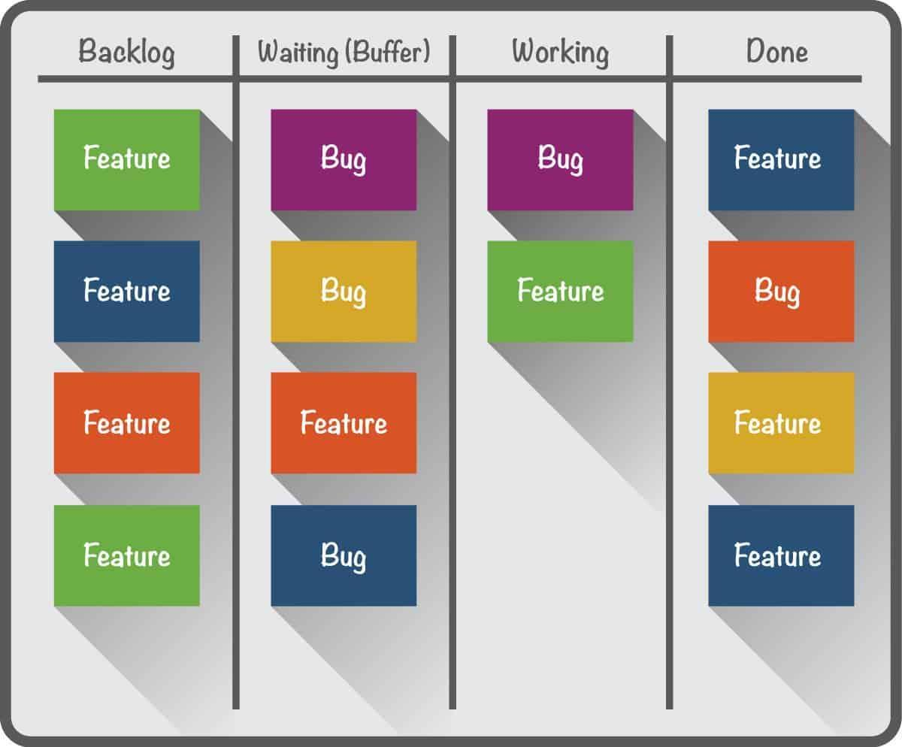
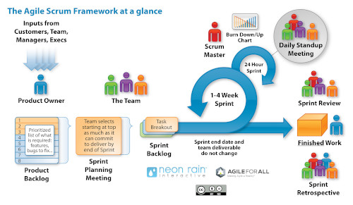

# 4. Metodologías de desarrollo

## Índice

[1. Ciclo de vida del software en cascada](#1-ciclo-de-vida-del-software-en-cascada)  
[2. Metodologías ágiles](#2-metodologías-ágiles)

## 1. Ciclo de vida del software en cascada

## 2. Metodologías ágiles

- Kanban

    

- Scrum

    

## Referencias

[Desarrollo en cascada](https://es.wikipedia.org/wiki/Desarrollo_en_cascada)  
[Metodologías ágiles](https://www.progressalean.com/metodologia-agile/)  
[Scrum](https://www.iebschool.com/blog/metodologia-scrum-agile-scrum/)  
[Kanban](https://businessmap.io/es/recursos-de-kanban/primeros-pasos/que-es-kanban)